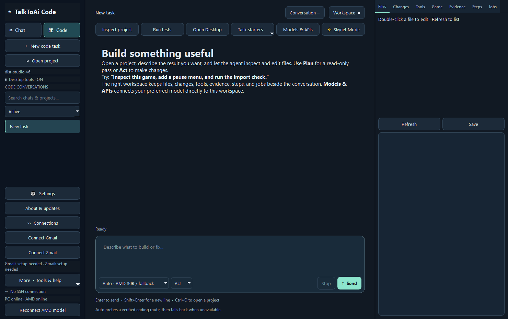
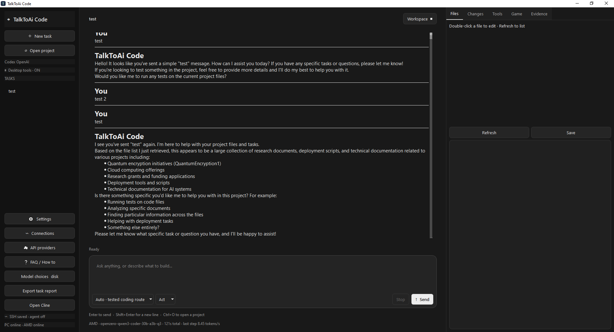
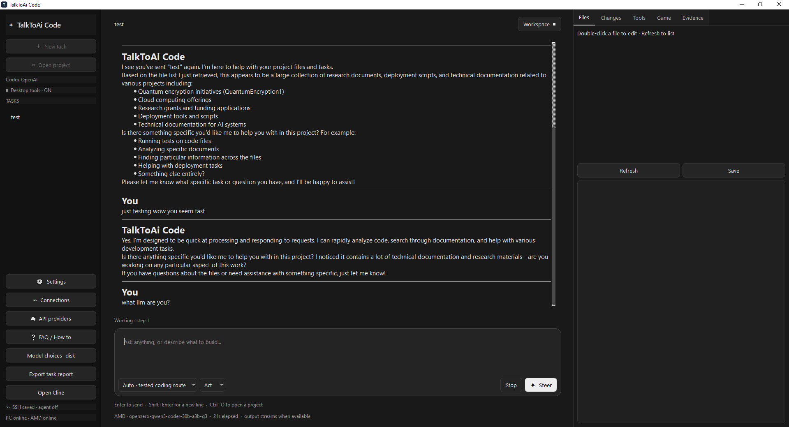
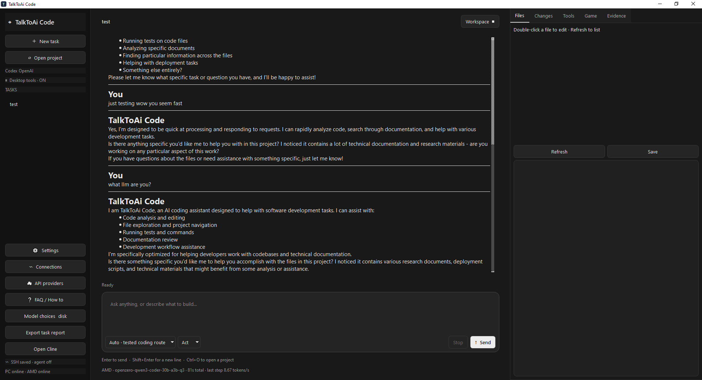
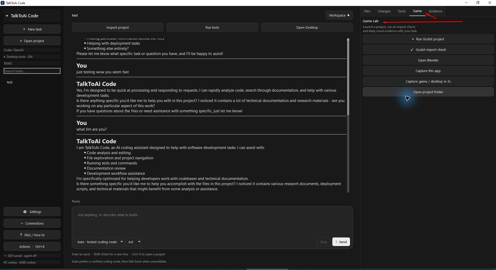

# TalkToAi Code — Your projects. Your AI. Your workspace.

> **Latest release: 0.4.1** — [Download the Windows installer](https://github.com/ResearchForumOnline/TalkToAi-Code/releases/download/v0.4.1/TalkToAi-Code-0.4.1-Windows-Setup.exe) · [View release notes and checksums](https://github.com/ResearchForumOnline/TalkToAi-Code/releases/tag/v0.4.1)

**Microsoft Store:** The separate MSIX edition was submitted for certification on 23 September 2026 with a manual publication hold at the last recorded check. See [submission status](docs/MICROSOFT-STORE-STATUS.md) and verify the current Store state separately. The installer above is the GitHub release.

## Product tour

The workspace above is rendered from the actual app with a disposable profile; it is not a model-performance result. Earlier Windows screenshots below show real user conversations.

The app is built around a simple loop: describe the outcome, let the agent inspect and act, steer it when needed, then review evidence.

| Ask and edit | Steer a running task |
| --- | --- |
|  |  |

| Review the result | Build and test games |
| --- | --- |
|  |  |

The screenshots are from the Windows app. They show the conversation workspace, automatic tested coding route, task steering, evidence-oriented responses, and Game Lab controls for Godot, Blender and capture workflows.

TalkToAi Code is a native Windows coding workspace for people who want to build software and games with local or self-hosted AI. The app is designed around one clear request: describe the outcome, let the agent inspect and act, then review the evidence.

An independent native desktop AI assistant from TalkToAI for coding, games and general project work. Use your local Ollama models, your own SSH-connected Ollama server, or an optional API provider. This is an independent product; no model or subscription is included.

## Install

**Recommended for Windows:** download the installer linked above, run setup and open **TalkToAi Code** from Start. Python is bundled; you do not need the source setup below. Future releases can be checked from **About & updates** inside the app.

## Updates and saved settings

### New in 0.4.0 preview: Chat, Code, connectors and Skynet Mode

Separate **Chat** and **Code** spaces retain their conversations across restarts. Chat starts in read-only Plan mode; select Act when you want authorized tools to take action. Pin, archive, branch or move conversations between spaces. The refreshed Windows interface places the native model selection and Skynet Mode within the Code workspace.

**Skynet Mode** is an opt-in, bounded candidate improvement workflow. It copies eligible project source to a separate temporary folder, makes up to two focused improvement passes with the selected model, runs detected checks and records a diff and JSON report. It never replaces the original project or installs an update automatically. Project checks still run with the signed-in user's permissions; review the report, changed tests and source before applying anything.

Optional **Gmail** and **Zmail** controls support read-only search and selected message/thread reads after each user configures a separate OAuth client and signs in. Tokens stay in Windows Credential Manager. The app does not include shared credentials or a mail send tool. See [mail connector setup](MAIL-CONNECTORS.md).

The AMD runtime can reconnect its loopback SSH tunnel, and coding-agent tool replies are paired to their call IDs. Browser tools are available for ordinary web research requests. A failed check no longer satisfies the agent's post-edit verification gate. See [0.4.0 release notes](RELEASE-0.4.0.md) for validation and limits.

### New in 0.3.0 preview: jobs, deliverables and own-key OpenAI

The current source adds a **Jobs** panel for turn-owned native processes,
incremental output polling and cancellation, plus **batch project reads** with
SHA-256/continuation offsets and **registered deliverables** in Evidence.
Build/test output is distinct from claims of test coverage. Jobs stop at turn
end; this is not a persistent hosting daemon.

**More → API providers → OpenAI API** configures direct OpenAI access using
**each user's own key and account**. No developer/shared API key is provided.
Local/open-weight inference remains the default, and Auto never falls back to a
paid provider. Users who prefer API-only use can explicitly select their saved
profile and make it their startup default. Other compatible endpoints remain
supported, including a local-server preset.

Paste a key for this session, reference an environment variable, or opt into
Windows user-encrypted storage. Fetch models performs metadata discovery, not
generation or a tool-capability test. Choose a model supporting Chat Completions
and function tools. Set a per-response output-token ceiling; repeated calls can
still incur charges. Reported token usage is not a billing total. Profile JSON
contains settings only, not keys. The app's Forget saved key action does not
modify external environment variables.

The OpenAI adapter uses `max_completion_tokens`, leaves sampling defaults alone,
requests usage metadata, and sets `store: false`. This does not promise zero
provider retention. Implementation references:
[Chat Completions](https://developers.openai.com/api/reference/resources/chat/subresources/completions/methods/create),
[function calling](https://developers.openai.com/api/docs/guides/function-calling),
[model listing](https://developers.openai.com/api/reference/resources/models/methods/list).

This unsigned GitHub release is separate from the Microsoft Store package. See the [last recorded Store submission status](docs/MICROSOFT-STORE-STATUS.md), [0.3.0 release notes](RELEASE-0.3.0.md) and the
[DevSpace ideas/licence review](docs/DEVSPACE-IDEAS-REVIEW.md). No DevSpace
product code was copied into this implementation.

### More automatic tool use in 0.2.5

Describe the outcome, not the name of a tool. The agent receives a bounded project overview and can call `enable_tools` to load additional code-navigation, browser, game, desktop or SSH tools as needed. This removes keyword-only availability for authorized capabilities. Loading a tool set does not execute it, grant a permission, configure a server, or bypass Plan/Act settings.

For multi-step work, `update_plan` maintains a saved checklist in **Steps**. Unfinished checklist items get a follow-through prompt before the agent finishes. Output-length limits can trigger up to two automatic continuations within the existing turn budget; Stop still cancels. The **Continue unfinished work** button resumes a saved task without replacing a draft.

The Steps panel separates **agent-reported progress** from **check-runner evidence**. Detected check commands report passed, failed or unverified status; subsequent tool-recorded edits make that status stale. Arbitrary shell commands no longer count as checking edits. This does not monitor filesystem changes made outside the tracked file tools or guarantee full product/game verification.

Invalid structured tool batches are rejected before any action in the batch executes, then the model can correct its request. An incomplete batch at an output limit is never executed. Identical consecutive failures stop being re-executed after two attempts; a successful intervening tool call resets that guard.

Automation still depends on the model. The deterministic test suite covers the controller, not general model competence. A bounded local `qwen3.5:4b` acceptance check on the build machine timed out after 120 seconds before producing tool calls; it did **not** establish live-model completion or responsiveness. No paid API was used for that check.

**Project memory** (More menu or Ctrl+Shift+M) stores editable project notes in `.talktoai-code/PROJECT_MEMORY.md`: goals, decisions, test commands and next steps. Future tasks in the same project receive these notes. They are sent to your selected model, so do not store passwords or private keys. Conflicting edits are detected; memory is capped at 12,000 characters. This is explicit project context rather than automatic recall of all past chats.

### A tidier, more resilient workspace in 0.2.4

- **Search across conversations:** titles, projects, unsent drafts and user/assistant messages. Ctrl+Shift+F focuses search; Ctrl+F finds text in the open conversation.
- **Archive without deleting:** switch between Active, Archived and All chats. Right-click a chat, or use **Chat ···**, to rename, pin, branch, archive/restore, copy the last reply or export a report.
- **Recover saved chats:** atomic saves keep a validated previous-save `studio.json.bak`. If history is damaged, the app preserves the unreadable file and recovers the valid backup with a visible notice. This is local chat recovery, not a substitute for project or off-device backups.
- **Start with a useful request:** seven editable starters cover coding, websites, games, debugging, release review, SSH inspection and unfinished work. They do not execute automatically or replace existing drafts; edit the placeholders and press Send.
- **A bundled game to learn with:** Game → Open example game (or `open score arena`) creates an editable Score Arena copy under the app's persistent data folder. Reopening it preserves your changes. Install Godot separately to run it.
- **Less sidebar clutter:** More groups project memory, API providers, ZeroThink linking, model choices and help. Settings, Connections and About & updates remain immediately visible.
- **Reliability fixes:** new/branched chats select correctly even with pinned conversations, refreshing the chat list preserves the current file editor, and local model choices save with user settings.

Drafts autosave after a short typing pause. Ctrl+, opens Settings. Ctrl+K includes project memory, update checks and shortcuts to the project and app-data folders.

Open **About & updates** in the sidebar to check GitHub, read release notes and download a newer installer. Downloads are verified against GitHub's SHA-256 asset digest before installation is offered. Finish or stop an active task before installing. Checking releases consumes no AI tokens; updates never install automatically.

Settings and task history are saved in `%LOCALAPPDATA%\TalkToAiCode`. Enable **Start with Windows** in Settings to start in the notification area. Existing history stays local; this is task persistence, not automatic semantic memory across all projects.

### Source installation

### Ask the agent to connect to a server

In Act mode, try: **“Connect to my website server using my existing SSH config, inspect the project, and report its status.”** The agent can call `desktop_server_inventory` to discover aliases, then `connect_remote` to verify an existing connection before inspecting or changing remote files. Existing app profiles also work. If several hosts match, specify the alias. Keys stay in OpenSSH; password-only accounts and first-time host verification require normal interactive setup. Desktop discovery does not import plaintext password files into the model.

### Python source setup

1. Install Python 3.12 for Windows from https://www.python.org/downloads/windows/ (include the Python launcher).
2. Download and extract the Windows setup ZIP into a permanent user-writable folder.
3. Double-click `Install.cmd`. It creates a local virtual environment, installs the pinned dependencies from PyPI, and creates a **TalkToAi Code** desktop shortcut. Internet and sufficient disk space for the dependencies are required. Setup does not download an AI model.
4. Open the shortcut, select your project, and choose a runtime. Local Ollama defaults to `qwen3.5:4b`; install a suitable model separately or change it in Model choices. A remote runtime needs your own SSH tunnel to localhost port 11435 and model settings. No private TalkToAI server is included.

### Platform installers

- **Windows:** use the [0.4.1 Windows installer](https://github.com/ResearchForumOnline/TalkToAi-Code/releases/download/v0.4.1/TalkToAi-Code-0.4.1-Windows-Setup.exe). This is an unsigned desktop installer, not a Microsoft Store package. The standard per-user installer creates Start Menu/Desktop shortcuts and an uninstaller, and preserves local task data during upgrades.
- **Portable Windows:** use the [0.1.3 portable ZIP](https://github.com/ResearchForumOnline/TalkToAi-Code/releases/download/v0.1.3-preview/TalkToAi-Code-0.1.3-Windows-Portable.zip) when you do not want an installer.
- **Linux:** install Python 3, extract the source ZIP, and run `bash install-linux.sh`. This creates a virtual environment, a `talktoai-code` launcher, and a desktop entry.
- **macOS:** install Python 3, extract the source ZIP, and run `bash install-macos.sh`. This creates a local virtual environment and a `talktoai-code` launcher.

The Windows native runtime is currently packaged for Windows x64. Linux and macOS use the source installers because native signed builds for those operating systems are not produced on this Windows build host.

## ZeroThink / AgentZero account and vault

Open **More → Link ZeroThink account**, choose your vault provider and exact model ID, and complete the normal web sign-in and device approval. The desktop remembers its own session using Windows DPAPI. Provider keys remain in the server vault. Do not copy your Google password or vault keys into chat. `link zerothink` also opens the dialog. The existing account/device API is used; no server auth change is required.

The vault adapter is experimental: it requests a structured JSON reply from the selected model and validates the whole tool batch before execution. Invalid replies fail without executing that batch. Model tool reliability varies. Local/AMD routes use native Ollama tool calls. The adapter's mock protocol, Windows token encryption and URL checks were tested; a real signed-in vault inference has not yet been verified. Account entitlements and provider quotas still apply. APIs are not guaranteed free; no paid provider is selected automatically.

Use your account's device controls to revoke access. Closing the linking dialog cancels polling; an already issued session may need revocation in the account.

## Working

- Act permits project edits and commands. Plan is for inspection. Commands run with your signed-in Windows account permissions.
- Desktop / user access and PC Pilot can operate accessible Windows controls. Browser tools use a separate Edge session, not personal cookies. Close unrelated sensitive windows before screenshots.
- File-tool edits are checkpointed. Shell/SSH changes do not receive the same automatic rollback.
- Ask for a reviewer, investigator or test planner subagent. Up to two workers run sequentially per turn, five model steps each. They inspect local project files; the main agent makes changes.
- Checks detect Godot import, Python, package scripts, Rust and .NET. Unity uses project-specific commands. Blender and Godot must be installed separately.
- Closing the window normally hides it in the tray; choose Quit to exit. Stop cancels the active run. Detached remote processes may outlive SSH cancellation.
- F1 opens help; Ctrl+K opens actions. Steer lets you redirect work during a task.

## Privacy and limits

Task history is stored locally under `%LOCALAPPDATA%/TalkToAiCode`. Selecting an API or remote model sends task context and tool results to that endpoint; review the scope of files you ask it to inspect. The source ZIP includes no credentials, personal server profiles, saved tasks, model weights or private configuration. No automatic updater is installed. This app does not guarantee coding accuracy, full game playtesting, or parity with any hosted assistant.

## Development

Install `requirements-desktop.txt` and run `python -m unittest discover -q`. Start with `python studio.py`. Build a Windows folder executable using `Build-Studio.ps1`; distribution of dependency binaries requires their applicable notices and source/licensing obligations. The published setup ZIP contains this project's source and installs third-party libraries normally through pip.

Original application source: MIT, see LICENSE. Dependencies retain their own licenses; see THIRD-PARTY-NOTICES.md.

Website: https://talktoai.org/TALKTOAIcode/
Source/releases: https://github.com/ResearchForumOnline/TalkToAi-Code

### 0.4.1: your models, one workspace

Groq now has its own API preset. Open **Models & APIs**, choose **Groq API**, enter your own key (or set `GROQ_API_KEY`), fetch models, select a tool-capable model and save/use the profile. Provider account limits apply. Coding stays inside TalkToAi Code; the Cline launcher has been removed. The updater now discovers published Windows preview releases as well as stable releases.
