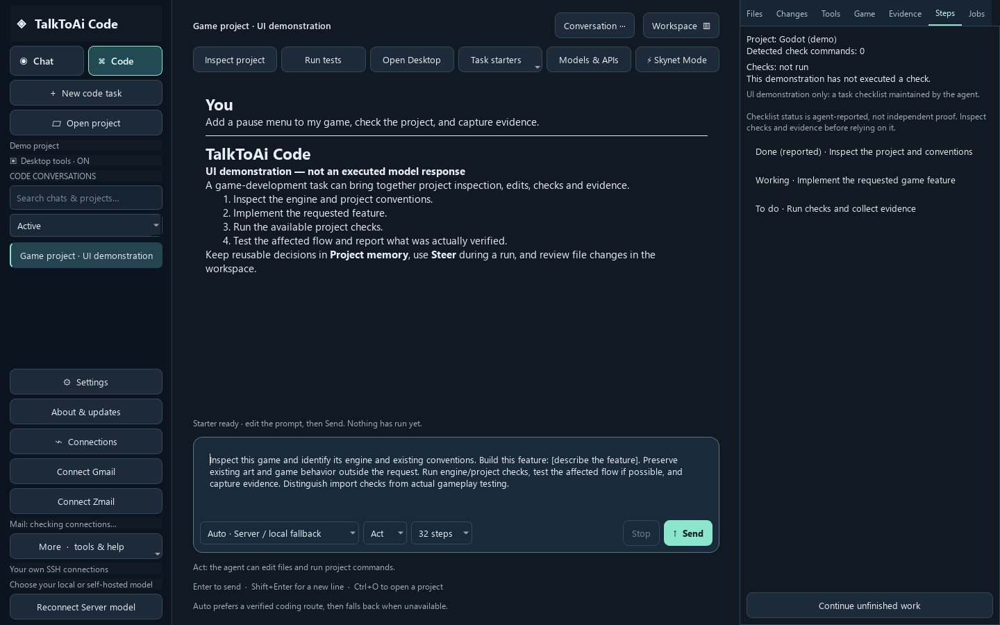
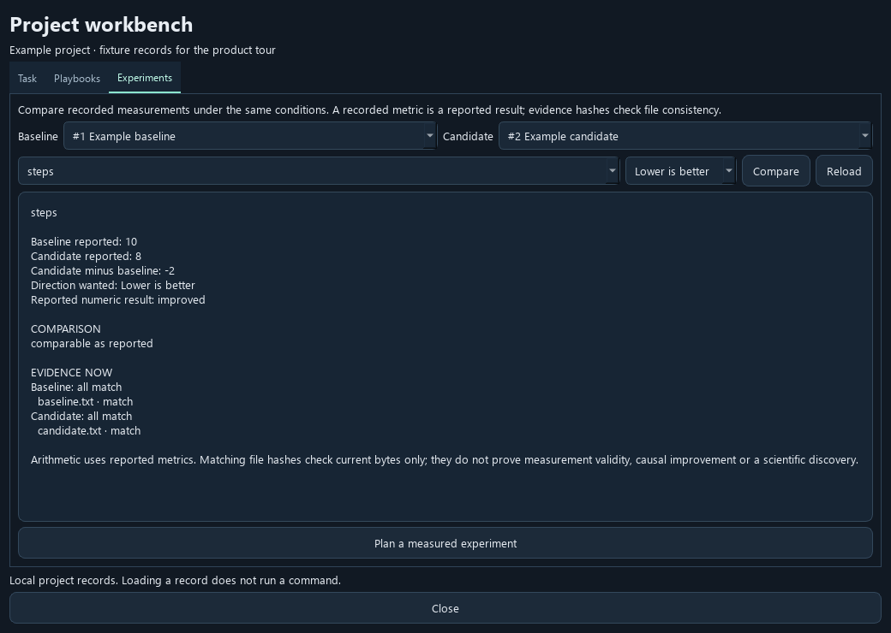
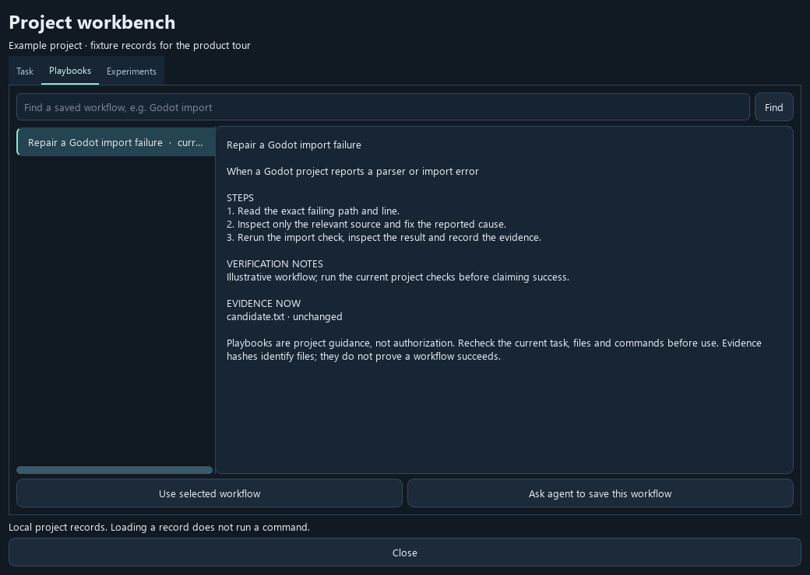
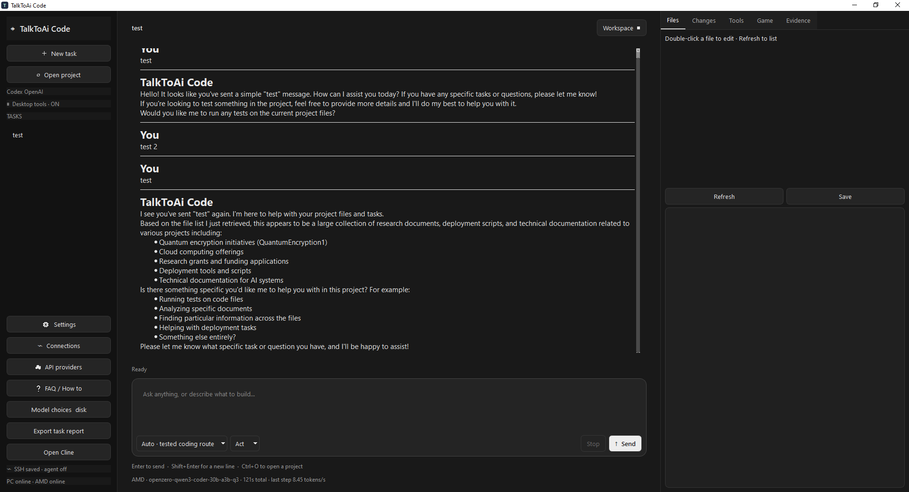
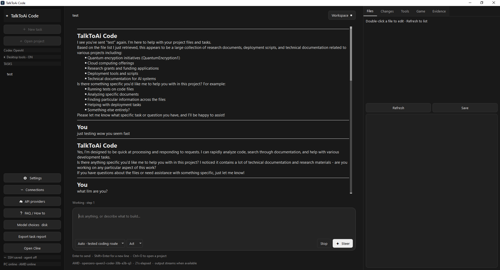
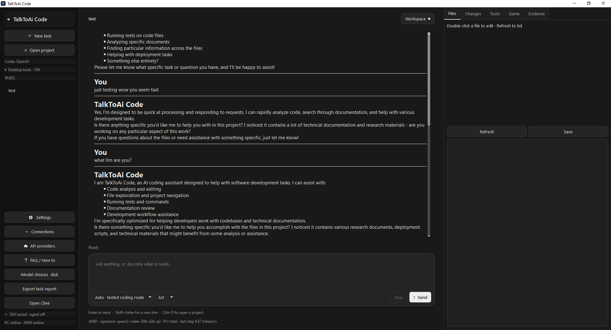
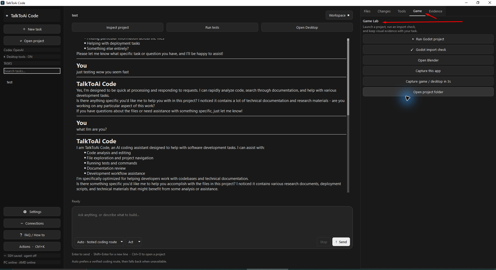

# TalkToAi Code — Your projects. Your AI. Your workspace.

> **Latest release: 0.12.0** — [Download the Windows installer](https://github.com/ResearchForumOnline/TalkToAi-Code/releases/download/v0.12.0/TalkToAi-Code-0.12.0-Windows-Setup.exe) · [View release notes and checksums](https://github.com/ResearchForumOnline/TalkToAi-Code/releases/tag/v0.12.0)

### 0.12.0: apply checked candidates, tune your workspace, audit decisions

After Skynet Mode selects a candidate that passed the recorded checks, **Evidence → Apply checked Skynet candidate** shows the file plan and asks before changing the original project. The app rechecks the original and candidate hashes, keeps an original-file backup, and records an application manifest. **Restore last applied candidate** checks that the applied files have not changed before restoring them. A passing check or evaluator metric covers only what that check or metric measured; review the diff and run the project yourself. [Customize and improve](docs/CUSTOMIZE-AND-IMPROVE.md).

In Code / Act, the agent can inspect and change a small allowlist of future app preferences, including Keep going, context size, browser choice, visible activity and Skynet iteration count. Every change is recorded and can be rolled back if later edits do not conflict. Access permissions, credentials, provider profiles, model IDs and weights stay outside this setting tool. [Agent preference controls](docs/AGENT-PREFERENCES.md).

For a local model whose answer hits its output ceiling, the controller can allow a longer next response when context permits. A plain **Continue** on a mail task retains the earlier substantive request so the read-only Gmail or Zmail tools can be discovered again. The new [routing evaluation audit](docs/ROUTING-EVALUATION.md) compares two sets of decisions on the same project-local labelled cases: false allows, false reviews, deferrals, family breakdowns and optional probability forecast scores. Labels are supplied by the evaluation file; this is a descriptive audit, not an ethical verdict or permission rule. See [0.12.0 release notes](docs/RELEASE-0.12.0.md).

### 0.11.0: a project workbench with reusable evidence

Open **More → Project workbench** for a Task view of the current checkpoint, Playbooks with project-owned workflow steps and rechecked evidence files, and Experiments that compare reported baseline and candidate metrics under recorded conditions. Playbooks are guidance for the current request, not permission to run commands. Experiment comparisons show missing or differing dataset, split, seed, environment, controls, budget, metric definition and sample size; matching file hashes establish byte consistency, not a scientific result. The research journal can also record specific claims alongside source URLs and their reported support or uncertainty.

The run now observes bounded source-file changes made through shell commands as well as the file editor and marks checks stale when source changes after verification. The scope and completeness of each scan are shown; files outside it need separate review. **Skynet Mode** keeps a frozen baseline and check files, runs detected checks in a disposable source copy, and offers one to five candidate iterations. Without a project evaluator, it retains the latest candidate that passed checks. With a frozen `SKYNET-EVALUATOR.json` contract, it selects only a checked candidate whose finite metric strictly improves on the baseline or previous best. Checks-only selection is not a measured quality gain; the original project is not replaced. Fresh Code conversations select Keep going with a two-hour ceiling; saved choices stay as they are. See [0.11.0 release notes](docs/RELEASE-0.11.0.md) and [Project playbooks](docs/PROJECT-PLAYBOOKS.md).

In a disposable live coding fixture, the configured 30B server model ran for 258.3 seconds and reached eight tool steps. It changed one source file to fix an inclusive-bound calculation, then two unchanged tests passed and it saved a playbook. The task paused at the eight-step limit. The runtime reported zero bytes of model VRAM allocation; this fixture does not establish GPU speed, game-scale capability, or general coding reliability.

### 0.10.0: clearer live work and longer coding sessions

After Send, the app immediately shows **Request received** while it connects to the selected runtime. This is app status, not an invented model reply. During inference it shows the model step and elapsed wait; Stop and Steer remain available. **More → Show model activity** can display a short, live excerpt only when an Ollama model supplies a separate reasoning stream. The option applies to the next request, is off by default, and may slow generation. Reasoning activity is not saved as a chat message; API providers and models without that stream retain normal progress status.

Code's **Keep going** now offers a selected one, two or four-hour maximum, with bounded model steps and work passes. It can stop earlier for completion, cancellation, repeated discovery, unresolved failures or lack of new evidence. The Tools panel keeps long command and source output readable with horizontal scrolling. See [0.10.0 release notes](docs/RELEASE-0.10.0.md) for limits and verification.

### 0.9.0: less wasted discovery, visible progress and a readable operating policy

Filter project discovery with `list_files` patterns such as `*.gd` or `*.tscn`. Shell instructions now explain Windows PowerShell syntax and provide recovery guidance after errors. Shell calls no longer reset repeated-discovery detection. The progress display shows phase, elapsed time, tools, tracked edits and the age of the last update; paused tasks explain recorded checks, blockers and the next action. Model diagnostics report loaded CPU/GPU allocation without downloading or loading anything; completed response metrics distinguish loading, prompt processing and generation when the provider supplies them.

A readable operating policy permits ordinary coding, research and authorized security testing. Its fixed digest is checked before inference and around tool execution; direct agent edits and Skynet candidates changing that policy are rejected. General application code remains editable. This is an app-level, tamper-evident boundary, not an OS sandbox or immutable open-source code. No keyword topic ban, moral probability score or license restriction was added. [Policy and research basis](docs/OPERATING-POLICY.md).

### 0.8.0: visible computer control and Escape cancellation

During desktop control a floating indicator says **TalkToAi is using your computer**, describes the current action without displaying typed text, and provides **Stop**. Browser automation is labelled **TalkToAi is working in its browser** because it uses an app-owned browser. The overlay stays visible until the session finishes and does not take keyboard focus. Physical **Escape** cancels the active task on Windows even when another app is foreground. Injected keyboard actions do not trigger this shortcut. Other platforms, or failed hook registration, clearly show the in-app Escape fallback. Stop preserves queued steering as a draft instead of restarting it. Cancellation stops further work; an action already delivered is not undone.

Browser clicks now use exact accessible names from the current observation, reject ambiguous targets, and follow one immediate popup. Closing that popup returns to a live page. Multiple or delayed popups may require opening the intended URL explicitly.

### 0.7.1: Qwen tool-call compatibility repair

Complete Qwen function blocks that Ollama leaks as text are validated against enabled tool schemas before execution. Missing closing tags, incomplete batches and ambiguous content are retried without execution. Chat no longer shows blank tool-call rows or raw protocol fragments; new runs clear the visible Tools panel while preserving saved activity.

### 0.7.0: persistent task goals

Save the intended outcome, 1-8 acceptance criteria, evidence notes and next action with each conversation. **Steps → Task goal** lets you inspect and edit the brief; the agent can maintain it while working. Pending criteria trigger a bounded review before completion. Goals survive reopening and context condensation, remain scoped to the project, and appear in task exports. Criterion status is self-reported, not proof. [Goal-driven work](docs/GOAL-DRIVEN-WORK.md).

### 0.6.1: recovery, evidence verification and model diagnostics

Use **Model choices & storage → Diagnose local / server connection** to distinguish a stopped runtime, invalid endpoint and missing model without inference or downloads. Windows controls now have snapshot-specific IDs so a stale control reference cannot silently target a new button after inspection. Research journals can recheck recorded evidence against current files. Keep going reviews unresolved errors and owned jobs before treating a task as finished.

### 0.6.0: project targeting and longer coding tasks

Public installations use **Server** for remote inference; choose a personal **Server name** in Settings. Fresh installs use `qwen3-coder:30b` as the server model ID; existing settings are preserved. Set model IDs for your installed Ollama runtimes, and use **Models → Compare installed coding models** for two bounded code/tool fixtures. The comparison is advisory and does not download models or silently change defaults.

Named projects such as `game: NIGHTFALL` are resolved inside the selected or explicitly named workspace before inference. Ambiguous matches stop for project selection. `use Server always` selects Server inference without moving your local project to a server.

A deterministic discovery guard detects repeated unchanged searches, provides recovery guidance and pauses explicitly unfinished work if the loop persists. The agent now condenses older exchanges into an evidence checkpoint instead of aborting when ordinary conversation history fills its context budget. The current objective and complete recent tool batches stay together, and saved history remains intact. Context sizes are estimates; important omitted details may require rereading the source.

Skynet candidates now preserve supported Godot and Unity source and small assets, including nested source ZIP projects. Use project `AGENTS.md` for coding conventions and acceptance criteria. See [Customize and improve](docs/CUSTOMIZE-AND-IMPROVE.md) for project guidance and editing TalkToAi Code's own source.

**Microsoft Store:** The separate MSIX edition was submitted for certification on 23 September 2026 with a manual publication hold at the last recorded check. See [submission status](docs/MICROSOFT-STORE-STATUS.md) and verify the current Store state separately. The installer above is the GitHub release.

## Product tour

The workspace above is rendered from the actual app with a disposable profile; it is not a model-performance result. Earlier Windows screenshots below show real user conversations.

### Project workbench in 0.11.0

The actual 0.11.0 Experiments interface is shown with example fixture records. The comparison illustrates reported arithmetic and evidence-file checks; it is not a model-performance or scientific result.

The actual 0.11.0 Playbooks interface is shown with an example fixture workflow. The steps and matching file hash illustrate the view; they do not prove that an agent completed that workflow.

The app is built around a simple loop: describe the outcome, let the agent inspect and act, steer it when needed, then review evidence.

| Ask and edit | Steer a running task |
| --- | --- |
|  |  |

| Review the result | Build and test games |
| --- | --- |
|  |  |

The screenshots are from the Windows app. They show the conversation workspace, automatic tested coding route, task steering, evidence-oriented responses, and Game Lab controls for Godot, Blender and capture workflows.

TalkToAi Code is a desktop coding workspace for people who want to build software and games with local or self-hosted AI. The app is designed around one clear request: describe the outcome, let the agent inspect and act, then review the evidence.

An independent native desktop AI assistant from TalkToAI for coding, games and general project work. Use your local Ollama models, your own SSH-connected Ollama server, or an optional API provider. This is an independent product; no model or subscription is included.

## Install

**Recommended for Windows:** download the installer linked above, run setup and open **TalkToAi Code** from Start. Python is bundled; you do not need the source setup below. Future releases can be checked from **About & updates** inside the app.

## Updates and saved settings

### Introduced in 0.4.0: Chat, Code, connectors and Skynet Mode

Separate **Chat** and **Code** spaces retain their conversations across restarts. Chat starts in read-only Plan mode; select Act when you want authorized tools to take action. Pin, archive, branch or move conversations between spaces. The refreshed Windows interface places the native model selection and Skynet Mode within the Code workspace.

**Skynet Mode** is an opt-in, bounded candidate improvement workflow. It copies eligible project source to a separate temporary folder, makes up to two focused improvement passes with the selected model, runs detected checks and records a diff and JSON report. It never replaces the original project or installs an update automatically. Project checks still run with the signed-in user's permissions; review the report, changed tests and source before applying anything.

Optional **Gmail** and **Zmail** controls support read-only search and selected message/thread reads after each user configures a separate OAuth client and signs in. Tokens stay in Windows Credential Manager, macOS Keychain or a Linux desktop keyring. The app does not include shared credentials or a mail send tool. See [mail connector setup](MAIL-CONNECTORS.md).

The Server runtime can reconnect its loopback SSH tunnel, and coding-agent tool replies are paired to their call IDs. Browser tools are available for ordinary web research requests. A failed check no longer satisfies the agent's post-edit verification gate. See [0.4.0 release notes](RELEASE-0.4.0.md) for validation and limits.

### Introduced in 0.3.0: jobs, deliverables and own-key OpenAI

The current source adds a **Jobs** panel for turn-owned native processes,
incremental output polling and cancellation, plus **batch project reads** with
SHA-256/continuation offsets and **registered deliverables** in Evidence.
Build/test output is distinct from claims of test coverage. Jobs stop at turn
end; this is not a persistent hosting daemon.

**More → API providers → OpenAI API** configures direct OpenAI access using
**each user's own key and account**. No developer/shared API key is provided.
Local/open-weight inference remains the default, and Auto never falls back to a
paid provider. Users who prefer API-only use can explicitly select their saved
profile and make it their startup default. Other compatible endpoints remain
supported, including a local-server preset.

Paste a key for this session, reference an environment variable, or opt into
Windows user-encrypted storage. Fetch models performs metadata discovery, not
generation or a tool-capability test. Choose a model supporting Chat Completions
and function tools. Set a per-response output-token ceiling; repeated calls can
still incur charges. Reported token usage is not a billing total. Profile JSON
contains settings only, not keys. The app's Forget saved key action does not
modify external environment variables.

The OpenAI adapter uses `max_completion_tokens`, leaves sampling defaults alone,
requests usage metadata, and sets `store: false`. This does not promise zero
provider retention. Implementation references:
[Chat Completions](https://developers.openai.com/api/reference/resources/chat/subresources/completions/methods/create),
[function calling](https://developers.openai.com/api/docs/guides/function-calling),
[model listing](https://developers.openai.com/api/reference/resources/models/methods/list).

This unsigned GitHub release is separate from the Microsoft Store package. See the [last recorded Store submission status](docs/MICROSOFT-STORE-STATUS.md), [0.3.0 release notes](RELEASE-0.3.0.md) and the
[DevSpace ideas/licence review](docs/DEVSPACE-IDEAS-REVIEW.md). No DevSpace
product code was copied into this implementation.

### More automatic tool use in 0.2.5

Describe the outcome, not the name of a tool. The agent receives a bounded project overview and can call `enable_tools` to load additional code-navigation, browser, game, desktop or SSH tools as needed. This removes keyword-only availability for authorized capabilities. Loading a tool set does not execute it, grant a permission, configure a server, or bypass Plan/Act settings.

For multi-step work, `update_plan` maintains a saved checklist in **Steps**. Unfinished checklist items get a follow-through prompt before the agent finishes. Output-length limits can trigger up to two automatic continuations within the existing turn budget; Stop still cancels. The **Continue unfinished work** button resumes a saved task without replacing a draft.

The Steps panel separates **agent-reported progress** from **check-runner evidence**. Detected check commands report passed, failed or unverified status; subsequent tool-recorded edits make that status stale. Arbitrary shell commands no longer count as checking edits. This does not monitor filesystem changes made outside the tracked file tools or guarantee full product/game verification.

Invalid structured tool batches are rejected before any action in the batch executes, then the model can correct its request. An incomplete batch at an output limit is never executed. Identical consecutive failures stop being re-executed after two attempts; a successful intervening tool call resets that guard.

Automation still depends on the model. The deterministic test suite covers the controller, not general model competence. A bounded local `qwen3.5:4b` acceptance check on the build machine timed out after 120 seconds before producing tool calls; it did **not** establish live-model completion or responsiveness. No paid API was used for that check.

**Project memory** (More menu or Ctrl+Shift+M) stores editable project notes in `.talktoai-code/PROJECT_MEMORY.md`: goals, decisions, test commands and next steps. Future tasks in the same project receive these notes. They are sent to your selected model, so do not store passwords or private keys. Conflicting edits are detected; memory is capped at 12,000 characters. This is explicit project context rather than automatic recall of all past chats.

### A tidier, more resilient workspace in 0.2.4

- **Search across conversations:** titles, projects, unsent drafts and user/assistant messages. Ctrl+Shift+F focuses search; Ctrl+F finds text in the open conversation.
- **Archive without deleting:** switch between Active, Archived and All chats. Right-click a chat, or use **Chat ···**, to rename, pin, branch, archive/restore, copy the last reply or export a report.
- **Recover saved chats:** atomic saves keep a validated previous-save `studio.json.bak`. If history is damaged, the app preserves the unreadable file and recovers the valid backup with a visible notice. This is local chat recovery, not a substitute for project or off-device backups.
- **Start with a useful request:** seven editable starters cover coding, websites, games, debugging, release review, SSH inspection and unfinished work. They do not execute automatically or replace existing drafts; edit the placeholders and press Send.
- **A bundled game to learn with:** Game → Open example game (or `open score arena`) creates an editable Score Arena copy under the app's persistent data folder. Reopening it preserves your changes. Install Godot separately to run it.
- **Less sidebar clutter:** More groups project memory, API providers, ZeroThink linking, model choices and help. Settings, Connections and About & updates remain immediately visible.
- **Reliability fixes:** new/branched chats select correctly even with pinned conversations, refreshing the chat list preserves the current file editor, and local model choices save with user settings.

Drafts autosave after a short typing pause. Ctrl+, opens Settings. Ctrl+K includes project memory, update checks and shortcuts to the project and app-data folders.

Open **About & updates** in the sidebar to check GitHub, read release notes and download a newer installer. Downloads are verified against GitHub's SHA-256 asset digest before installation is offered. Finish or stop an active task before installing. Checking releases consumes no AI tokens; updates never install automatically.

Settings and task history are saved in `%LOCALAPPDATA%\TalkToAiCode` on Windows, `~/Library/Application Support/TalkToAiCode` on macOS, and `~/.local/state/TalkToAiCode` (or `XDG_STATE_HOME`) on Linux. Enable **Start with Windows** in Settings to start in the notification area. Existing history stays local; this is task persistence, not automatic semantic memory across all projects.

### Source installation

### Ask the agent to connect to a server

In Act mode, try: **“Connect to my website server using my existing SSH config, inspect the project, and report its status.”** The agent can call `desktop_server_inventory` to discover aliases, then `connect_remote` to verify an existing connection before inspecting or changing remote files. Existing app profiles also work. If several hosts match, specify the alias. Keys stay in OpenSSH; password-only accounts and first-time host verification require normal interactive setup. Desktop discovery does not import plaintext password files into the model.

### Python source setup

1. Install Python 3.12 for Windows from https://www.python.org/downloads/windows/ (include the Python launcher).
2. Download and extract the Windows setup ZIP into a permanent user-writable folder.
3. Double-click `Install.cmd`. It creates a local virtual environment, installs the pinned dependencies from PyPI, and creates a **TalkToAi Code** desktop shortcut. Internet and sufficient disk space for the dependencies are required. Setup does not download an AI model.
4. Open the shortcut, select your project, and choose a runtime. Local Ollama defaults to `qwen3.5:4b`; install a suitable model separately or change it in Model choices. A remote runtime needs your own SSH tunnel to localhost port 11435 and model settings. No private TalkToAI server is included.

### Platform installers

- **Windows:** use the [0.12.0 Windows installer](https://github.com/ResearchForumOnline/TalkToAi-Code/releases/download/v0.12.0/TalkToAi-Code-0.12.0-Windows-Setup.exe). This is an unsigned desktop installer, not a Microsoft Store package. The standard per-user installer creates Start Menu/Desktop shortcuts and an uninstaller, and preserves local task data during upgrades.
- **Portable Windows:** use the [0.1.3 portable ZIP](https://github.com/ResearchForumOnline/TalkToAi-Code/releases/download/v0.1.3-preview/TalkToAi-Code-0.1.3-Windows-Portable.zip) when you do not want an installer.
- **Linux:** install Python 3.10+ with `venv`, extract the [0.12.0 source ZIP](https://github.com/ResearchForumOnline/TalkToAi-Code/archive/refs/tags/v0.12.0.zip) outside your app-data folder, and run `bash install-linux.sh` from that folder. This creates a user-local virtual environment, launcher and desktop entry. The app uses `~/.local/state/TalkToAiCode` or `XDG_STATE_HOME` for chats/settings. Install Ollama separately and pull a model before selecting Auto. A Secret Service desktop keyring is needed to remember API keys or OAuth tokens.
- **macOS:** install Python 3.10+, extract the [0.12.0 source ZIP](https://github.com/ResearchForumOnline/TalkToAi-Code/archive/refs/tags/v0.12.0.zip), and run `bash install-macos.sh` from that folder. This creates a local virtual environment, `~/bin/talktoai-code` launcher, and `~/Applications/TalkToAi Code.app` launcher. Chats/settings use `~/Library/Application Support/TalkToAiCode`. Install Ollama separately and pull a model. Remembered keys and account tokens use macOS Keychain.

Windows has a packaged x64 installer. Linux and macOS use source installers with per-user virtual environments; the [native Ubuntu and macOS install-and-launch smoke run](https://github.com/ResearchForumOnline/TalkToAi-Code/actions/runs/36245686313) passed using an offscreen GUI on clean GitHub runners. An interactive human workflow has not been confirmed on those hosts. Browser research, Chat/Code, local Ollama, project edits, shell commands, jobs and SSH use portable code paths. Windows accessibility PC Pilot and Windows startup shortcuts are Windows-only. Linux browser operation may need desktop libraries for Playwright Chromium; if its browser download fails, install them and rerun `python -m playwright install chromium` inside the app virtual environment.

## ZeroThink / AgentZero account and vault

Open **More → Link ZeroThink account**, choose your vault provider and exact model ID, and complete the normal web sign-in and device approval. The desktop remembers its own session using Windows DPAPI. Provider keys remain in the server vault. Do not copy your Google password or vault keys into chat. `link zerothink` also opens the dialog. The existing account/device API is used; no server auth change is required.

The vault adapter is experimental: it requests a structured JSON reply from the selected model and validates the whole tool batch before execution. Invalid replies fail without executing that batch. Model tool reliability varies. Local/Server routes use native Ollama tool calls. The adapter's mock protocol, Windows token encryption and URL checks were tested; a real signed-in vault inference has not yet been verified. Account entitlements and provider quotas still apply. APIs are not guaranteed free; no paid provider is selected automatically.

Use your account's device controls to revoke access. Closing the linking dialog cancels polling; an already issued session may need revocation in the account.

## Working

- Act permits project edits and commands. Plan is for inspection. Commands run with your signed-in Windows account permissions.
- Desktop / user access and PC Pilot can operate accessible Windows controls. Browser tools use a separate app-owned browser session with the configured browser preference and fallback, without personal cookies. Close unrelated sensitive windows before screenshots.
- File-tool edits are checkpointed. Shell/SSH changes do not receive the same automatic rollback.
- Ask for a reviewer, investigator or test planner subagent. Up to two workers run sequentially per turn, five model steps each. They inspect local project files; the main agent makes changes.
- Checks detect Godot import, Python, package scripts, Rust and .NET. Unity uses project-specific commands. Blender and Godot must be installed separately.
- Closing the window normally hides it in the tray; choose Quit to exit. Stop cancels the active run. Detached remote processes may outlive SSH cancellation.
- F1 opens help; Ctrl+K opens actions. Steer lets you redirect work during a task.

## Privacy and limits

Task history is stored locally under `%LOCALAPPDATA%/TalkToAiCode`. Selecting an API or remote model sends task context and tool results to that endpoint; review the scope of files you ask it to inspect. The source ZIP includes no credentials, personal server profiles, saved tasks, model weights or private configuration. No automatic updater is installed. This app does not guarantee coding accuracy, full game playtesting, or parity with any hosted assistant.

## Development

Install `requirements-desktop.txt` and run `python -m unittest discover -q`. Start with `python studio.py`. Build a Windows folder executable using `Build-Studio.ps1`; distribution of dependency binaries requires their applicable notices and source/licensing obligations. The published setup ZIP contains this project's source and installs third-party libraries normally through pip.

Original application source: MIT, see LICENSE. Dependencies retain their own licenses; see THIRD-PARTY-NOTICES.md.

Website: https://talktoai.org/TALKTOAIcode/
Source/releases: https://github.com/ResearchForumOnline/TalkToAi-Code

### 0.4.1: your models, one workspace

Groq now has its own API preset. Open **Models & APIs**, choose **Groq API**, enter your own key (or set `GROQ_API_KEY`), fetch models, select a tool-capable model and save/use the profile. Provider account limits apply. Coding stays inside TalkToAi Code; the Cline launcher has been removed. The updater now discovers published Windows preview releases as well as stable releases.

### Keep working with 0.6.0

Auto can start installed local Ollama when Server is unavailable. Failed requests return to the composer. More > Back up conversations exports a private ZIP. See [the guide](KEEP-WORKING.txt). Back up projects separately.

### Research and Windows control

Use the Research with sources starter or ask for a web search. Browser search returns page observations and source URLs; Plan allows search/open/inspect, while input actions require Act. Research instructions ask the model to open original sources and cite observed links. Search uses your configured engine with fallback in a task-owned browser; access can be blocked. Use Operate a Windows app in Act with Desktop/user access and PC Pilot enabled. The existing accessibility controls inspect windows, click, type and observe results. Completion depends on the model and application accessibility.

### Search choices in 0.6.0

Settings lets you prefer Edge, Chrome, Firefox or Playwright Chromium, with a browser fallback if the first one cannot start. Web search tries DuckDuckGo, Bing, Google and Brave. Add your own Serper key in Settings and select Serper to use its structured search results; those searches may use Serper account credits. Search results include source URLs, and the agent should open originals before citing them. More > Link ZeroThink account & vault already pairs your account with its provider vault; provider/model access requires account setup.

### Linux and macOS source install in 0.6.0

The source installers copy only runtime modules and the public sample, avoiding build output and local configuration. They install dependencies for their host OS and download Playwright Chromium when possible. Use `bash install-linux.sh` or `bash install-macos.sh` from an extracted release source folder. Linux requires a graphical desktop and a working Secret Service keyring for remembered credentials; macOS uses Keychain. On Ubuntu/Debian, install Qt runtime libraries with `sudo apt-get install libegl1 libgl1 libxcb-cursor0 libxkbcommon-x11-0 libxcb-xinerama0` if they are missing. On both platforms, the bundled Windows update installer is disabled; download a newer source release and rerun the appropriate script. Native signed Linux/macOS packages and interactive GUI validation are still outstanding. The source installer and offscreen GUI launch passed on Ubuntu and macOS GitHub runners.

### Keep going and research experiments

Enable **Keep going** in Code and select a one, two or four-hour maximum. A session has at most twelve passes of the selected step budget (maximum 768 steps) and can finish or pause earlier. Progress checkpoints remain visible; Stop interrupts the task. Unresolved errors or repeated unchanged exploration pause the work. A repaired failure can continue after checks pass on the latest files. This does not run unattended after the app closes.

Use **Research an experiment** to maintain a bounded project journal with hypotheses, reported metrics, next steps, and hashes of evidence files. See [research experiments](docs/RESEARCH-EXPERIMENTS.md) and the [measured model comparison](docs/MODEL-COMPARISON-0.6.0.md). Windows native controls use accessibility actions where available; acceptance testing fills and activates an isolated real Windows form.
