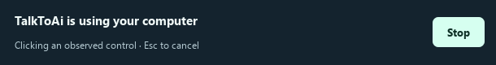

# TalkToAi Code 0.8.0

## Visible computer control you can cancel

- Desktop actions display **TalkToAi is using your computer**, the current action and a Stop button in a floating panel.
- Browser actions display **TalkToAi is working in its browser**: browser automation uses a separate app-owned session.
- Physical Escape cancels a busy task on Windows even when another app is foreground. The temporary hook ignores injected keyboard actions, stores no keystrokes, and is removed when the task finishes.
- On other platforms or failed hook registration, the panel clearly describes Escape inside TalkToAi and the Stop button.
- The panel stays above other windows without taking keyboard focus. Its labels omit typed text, search queries and URLs.
- Stopping remains visible until the worker finishes. Explicit Stop/Escape returns queued steering to the draft and prevents accidental restart, including cross-thread event races.
- Closing the active panel requests Stop. Idle Escape behavior in dialogs is unchanged.

The image is a rendered UI fixture, not evidence of a live computer task. Cancellation stops further work; it cannot undo an action already delivered. In-flight browser actions may take time to yield. Windows native control remains Windows-only; browser tools are portable.

## Browser workflow repairs

- Buttons and links can be clicked using the exact accessible name observed by the agent, including aria-labelled buttons with no matching visible text.
- Duplicate names are rejected before input. A changed page requires fresh inspection, and cancellation is checked immediately before the click.
- One immediate popup becomes the current page. Closing it recovers a live page in the same owned browser context.
- Multiple popups produce an explicit error instead of guessing. Arbitrary delayed/background popups are not guaranteed; opening the intended URL remains available.
- The model-facing tool description now explains these behaviors. Older documentation incorrectly describing fixed Edge/Bing selection has been corrected.

## Verification

- **300 Windows tests passed**, with native desktop and real browser acceptance enabled.
- Native desktop acceptance used an isolated Windows form. Global Escape registration/removal and native event classification passed without generating physical keyboard input. A manual physical-key end-to-end session remains unverified.
- Real browser checks used disposable localhost pages: accessible-name activation, duplicate-name rejection, cancellation before input, popup following and closure, multiple-popup rejection, stale-page rejection, form entry and screenshots.
- Regression tests cover task-bound cancellation callbacks, the finished-before-cancel event race, saved steering drafts, overlay lifecycle, non-focus flags and private argument omission.
- The packaged Windows executable passed its self-test: Escape hook registration, managed process execution, bundled sample, batch file reading, output hashing, browser interaction, popup handling, screenshot and image attachment. Packaged GUI startup also passed.
- Linux and macOS source installation, offscreen startup and portable/UI regression checks passed: https://github.com/ResearchForumOnline/TalkToAi-Code/actions/runs/36280216049

These checks establish the named workflows, not general model intelligence or parity with hosted assistants. Browser access can still be blocked by websites; Windows application control depends on accessibility support. Gmail/Zmail remain optional read-only connectors requiring account setup. This release does not change model weights or claim AGI.
